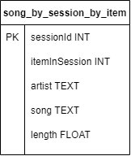
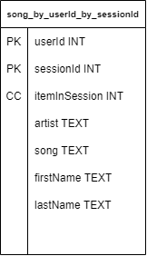
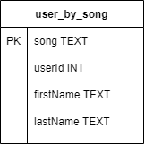

# Introduction 
A startup called Sparkify wants to analyze the data they've been collecting on songs and user activity on their new music streaming app. The analysis team is particularly interested in understanding what songs users are listening to. Currently, there is no easy way to query the data to generate the results, since the data reside in a directory of CSV files on user activity on the app.

They'd like a data engineer to create an Apache Cassandra database which can create queries on song play data to answer the questions, and wish to bring you on the project. Your role is to create a database for this analysis. You'll be able to test your database by running queries given to you by the analytics team from Sparkify to create the results.

# Project Description
In this project, you'll apply what you've learned on data modeling with Apache Cassandra and complete an ETL pipeline using Python. To complete the project, you will need to model your data by creating tables in Apache Cassandra to run queries. You are provided with part of the ETL pipeline that transfers data from a set of CSV files within a directory to create a streamlined CSV file to model and insert data into Apache Cassandra tables.

# Project Dataset
The dataset used for this project: event_data. The directory of CSV files partitioned by date. Here are examples of filepaths to two files in the dataset:
```
event_data/2018-11-08-events.csv
event_data/2018-11-09-events.csv
```
The datasets contains the following columns:
- artist
- first name of user
- gender of user
- item number in session
- last name of user
- length of the song
- level (paid or free song)
- location of the user
- sessionId
- song title
- userId

# Queries (result in jupyter notebook)
## Query 1: Give me the artist, song title and song's length in the music app history that was heard during sessionId = 338, and itemInSession = 4
Table created with Primary Key (sessionId,itemInSession)



## Query 2: Give me only the following: name of artist, song (sorted by itemInSession) and user (first and last name) for userid = 10, sessionid = 182
Table created with with Partition Key (userId, sessionId) and Clustering Column (itemInSession)



## Query 3: Give me every user name (first and last) in my music app history who listened to the song 'All Hands Against His Own'
Table user_by_song with Primary Key (song, userId)



# Project Respository Files
1. **event_data** folder nested at the home of the project, where all needed data reside.
3. **Project_1B_ Project_Template.ipynb** the code itself.
4. **event_datafile_new.csv** a smaller event data csv file that will be used to insert data into the Apache Cassandra tables.
5. **images** a screenshot of what the denormalized data should appear like in the event_datafile_new.csv. 
6. **README.md** current file, provides discussion on my project.

# How to Use

Launch **Project_1B_ Project_Template.ipynb** to run validation and example queries.
